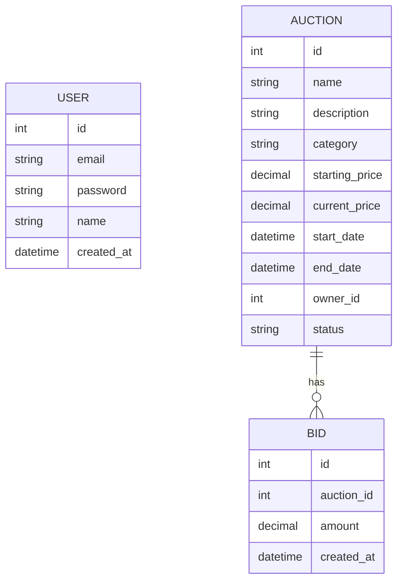

# Database Model

## Overview

System korzysta z relacyjnej bazy danych obsługiwanej przez Django ORM. Główne modele danych to `User`, `Auction` oraz `Bid`. Modele te przechowują informacje o użytkownikach, aukcjach oraz ofertach składanych w licytacjach.

## User Model

Model `User` przechowuje podstawowe dane użytkownika systemu.

Pola modelu:

- `id` — unikalny identyfikator użytkownika tworzony automatycznie przez Django.
- `email` — adres e-mail użytkownika. Pole jest unikalne, więc dwóch użytkowników nie może mieć tego samego adresu e-mail.
- `password` — hasło użytkownika.
- `name` — nazwa użytkownika.
- `created_at` — data i czas utworzenia użytkownika.

## Auction Model

Model `Auction` przechowuje dane dotyczące aukcji.

Pola modelu:

- `id` — unikalny identyfikator aukcji tworzony automatycznie przez Django.
- `name` — nazwa przedmiotu wystawionego na aukcję.
- `description` — opis aukcji.
- `category` — kategoria aukcji.
- `starting_price` — cena wywoławcza aukcji.
- `current_price` — aktualna najwyższa cena aukcji.
- `start_date` — data i czas rozpoczęcia aukcji.
- `end_date` — data i czas zakończenia aukcji.
- `owner_id` — identyfikator właściciela aukcji.
- `status` — status aukcji. Może przyjmować wartości `active` lub `ended`.

Pole `owner_id` jest obecnie przechowywane jako liczba całkowita. Nie jest ono zdefiniowane jako relacja `ForeignKey` do modelu `User`.

## Bid Model

Model `Bid` przechowuje oferty składane w aukcjach.

Pola modelu:

- `id` — unikalny identyfikator oferty tworzony automatycznie przez Django.
- `auction` — relacja do aukcji, której dotyczy oferta.
- `amount` — kwota złożonej oferty.
- `created_at` — data i czas złożenia oferty.

Każdy rekord `Bid` reprezentuje jedną ofertę złożoną w konkretnej aukcji. Dzięki temu system przechowuje historię ofert, zamiast nadpisywać poprzednie licytacje.

## Relationships

Model `Auction` jest powiązany z modelem `Bid` relacją jeden-do-wielu. Oznacza to, że jedna aukcja może posiadać wiele ofert, ale jedna oferta należy tylko do jednej aukcji.

Relacja ta jest zrealizowana przez pole `auction` w modelu `Bid`, które jest kluczem obcym do modelu `Auction`.

Usunięcie aukcji powoduje usunięcie wszystkich powiązanych z nią ofert, ponieważ w relacji zastosowano `on_delete=models.CASCADE`.

Model `Auction` posiada pole `owner_id`, które przechowuje identyfikator właściciela aukcji. Obecnie nie jest to relacja bazodanowa do modelu `User`.

## ERD

## Notes

Pole `owner_id` w modelu `Auction` wskazuje identyfikator właściciela aukcji, ale nie jest obecnie zdefiniowane jako klucz obcy w bazie danych.

W przyszłości można rozważyć zmianę pola `owner_id` na relację `ForeignKey` do modelu `User`, aby baza danych bezpośrednio pilnowała powiązania między użytkownikiem a jego aukcjami.